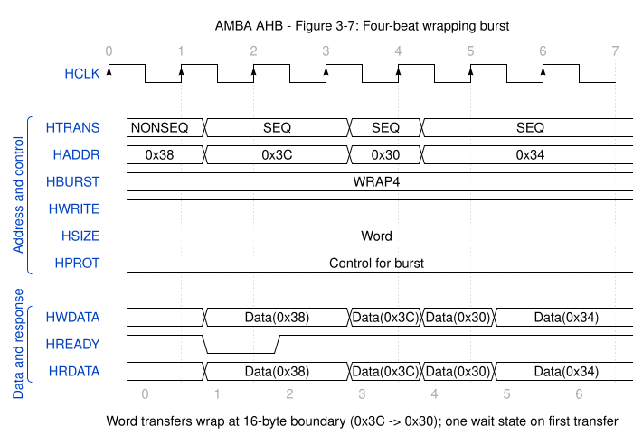

# WaveDrom Timing Diagram Skill

WaveDrom 数字时序图绘制技能。提供 WaveJSON 语法参考、无毛刺绘图规则、模板和同步总线协议示例。



## 文件结构

```
├── SKILL.md                     # 技能清单
├── references/
│   ├── wavedrom-syntax.md       # 脱敏精炼语法参考
│   ├── apb-timing.md            # APB 阶段、等待、连续传输及错误规则
│   ├── ahb-timing.md            # AHB/AHB-Lite 流水线、等待态、突发与回绕
│   └── spi-flash-read.md        # SPI NOR Flash 读时序约束
├── templates/
│   └── minimal.json             # 最小可渲染模板
├── examples/
│   ├── bus_demo.json            # Bus 数据段语义参考
│   ├── clocked_bus.json         # 配合时钟的 Bus 示例
│   ├── apb_read_write.json      # APB 简单写后读
│   ├── apb_read.json            # APB 单次读
│   ├── apb_read_wait.json       # APB 带等待状态的读
│   ├── apb_write.json           # APB 单次写
│   ├── apb_back_to_back.json    # APB 背靠背传输
│   ├── apb_error.json           # APB3 错误响应
│   ├── ahb_lite_read_write.json # AHB-Lite 简单写后读
│   ├── ahb_four_beat_wrapping_burst.json # AHB 四拍回绕突发（含等待态）
│   ├── spi_single_read.json     # SPI NOR 0x03，1-1-1
│   ├── spi_dual_read.json       # SPI NOR 0xBB，1-2-2
│   └── spi_quad_read.json       # SPI NOR 0xEB，1-4-4
├── README.md
├── LICENSE
└── .gitignore
```

## 用法

1. 以 `templates/minimal.json` 为起点
2. 参考 `references/wavedrom-syntax.md` 编写 WaveJSON
3. 绘制 APB 前先阅读 `references/apb-timing.md`，再按读、写、等待、背靠背或错误响应选择最接近的单场景示例
4. 绘制 AHB/AHB-Lite 前先阅读 `references/ahb-timing.md`，再按单次传输或回绕突发选择对应示例
5. 同步 Bus 和 SPI NOR 分别参考 `examples/` 下对应示例
6. 检查稳定电平使用 `.`、稳定 Bus 使用 `=.`，避免 `00`、`11` 和误用 `==`
7. 用 `wavedrom-cli` 渲染:

```powershell
wavedrom-cli --input <file.json> --svg <file.svg>
```

渲染后检查 SVG 中是否存在同电平尖峰、非预期 Bus 交叉、标签缺失或时钟错位。

最终图必须同时临时渲染为 PNG 并实际目视检查。成功生成 SVG 不等于时序和视觉正确；应检查 Bus 是否始终保持双线、标签是否重叠、APB/AHB 周期关系是否正确，并根据需要调整 `hscale` 后重新渲染。临时 PNG 检查完成后删除。

带时间压缩的协议图应把 Phase 行作为语义摘要：同一阶段只创建一个连续色块并标注一次。省略符号放在 SCLK、控制和详细数据行，Phase 行对应位置使用 `.` 保持，不得在省略符号后重新启动相同颜色的数据段。

或在 [WaveDrom Editor](https://wavedrom.com/editor.html) 中粘贴 JSON 在线预览。

## 安装为 opencode Skill

全局安装：

```powershell
git clone https://github.com/arthurwanggit/WaveDrom-skill "$HOME\.config\opencode\skills\wavedrom-timing-diagram"
```

项目级安装：

```powershell
git clone https://github.com/arthurwanggit/WaveDrom-skill ".opencode\skills\wavedrom-timing-diagram"
```

安装或更新后重启 opencode。

## License

本项目采用 [Apache License 2.0](LICENSE)。
